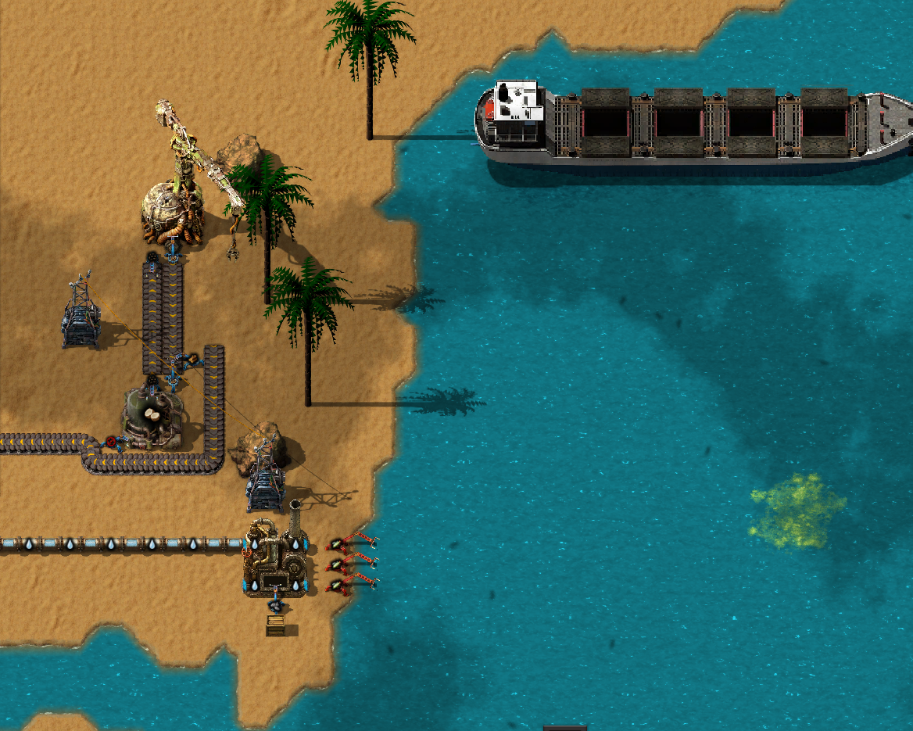
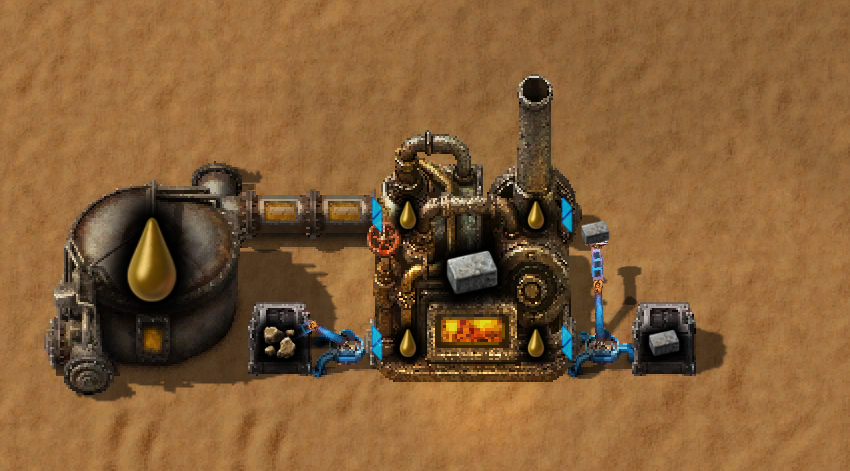
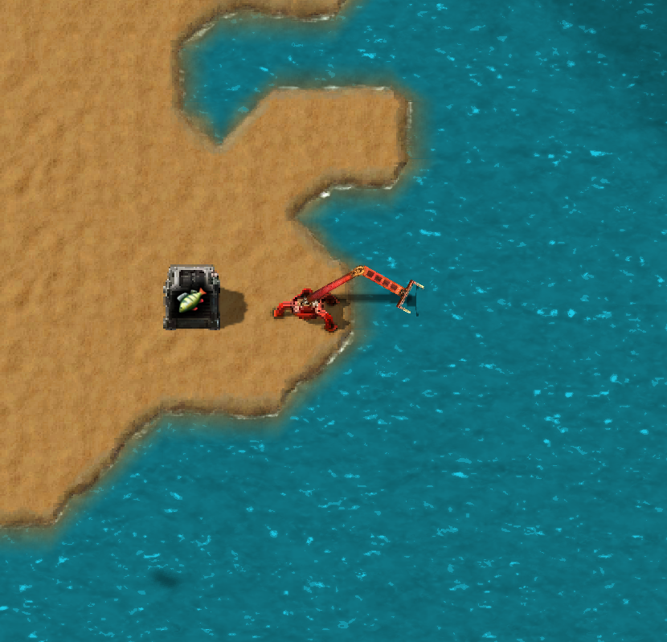

# Planet Pelagos

Welcome on Pelagos. Insular planet rich in tropical coconut palms, methane deposits, and mysterious lifeforms. 
Harvest coconuts, process them into oil, sealant, and biofuels ,experiment with fermentation and use high-temperature 
calciners to improve smelting processes in your factory. 

## Build around THE Cargo Ships mod
[Cargo Ships mod](https://mods.factorio.com/mod/cargo-ships)
- Essential Dependancy
- I love Cargo ships mod, but i always find it difficult to fit into vanilla game.
- I have tried dreadworks, but it ruins gleba which is my favourite planet. 
- So I created planet-mod designed around using ships as main transportation option.

## Canal Excavator mod
[Canal Excavator mod](https://mods.factorio.com/mod/canal-excavator)
- Essential dependancy
- You can't find stone patches on Pelagos. But you can mine ground with Canal Excavator.
1. Mine Stone on pelagos to unlock it
2. Craft Excavatable surface
3. Mine it with excavator to get some stone

## Calciner

- Big fluid powered furnace. 
- Can and should be used like regular furnace.
- Extra 50% productivity
- Allows the high-temperature purification and transformation of raw materials into refined minerals

## Giving new live to neglected fish related vanilla mechanics

Fish are good starting source of nutrients on Pelagos. And they are essential for progression
- (vanilla mechanic) You can place inserter near the water to catch fish. Remember to use negative filter (for fish) on your cargo ships unloading stations
- (vanilla mechanic) You can use fish breeding recipe on pelagos

## Integrations with other planet-mods: 
### Arig
- Pelagos Landfill productivity also affect Sandstone foundation if Arig is installed.
### Maraxis
- Coconut Sealant can be turned into Super Sealant Substance if maraxis is installed. 
- Recipe enables itself when you Research "Project Seadragon" just like regular Super Sealant Substance recipe
### Cerys
- Pelagos Methane overrides Cerys methane if Cerys is installed. 
- Methane is essential resource on Pelagos and it is almost unused on Cerys (vented into atmosphere). 
- With Pelagos You can now barel up methane and ship to other planets.
### Wood themed mods
- In addition to coconuts coconut palm gives small ammount of wood
- Calciner allows for wood carbonization (turning wood into coal)
- Pelagos research allows for wood spoiling in biochaber (turning wood into spoilage)

## Issues?
- DM me on discord or create issue on github.

## Credits
## TODOs
- [ ] Tips and tricks
- [ ] Calciner as separate mod
